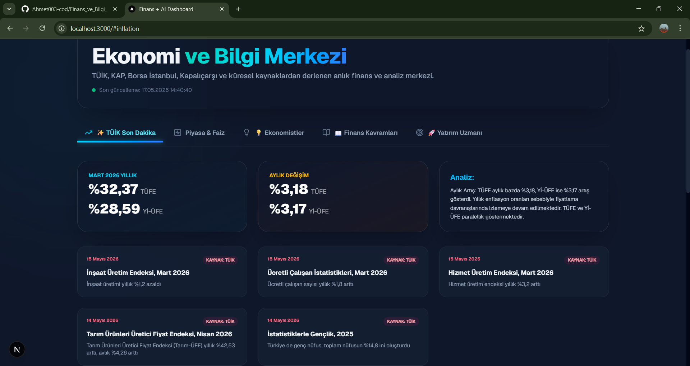
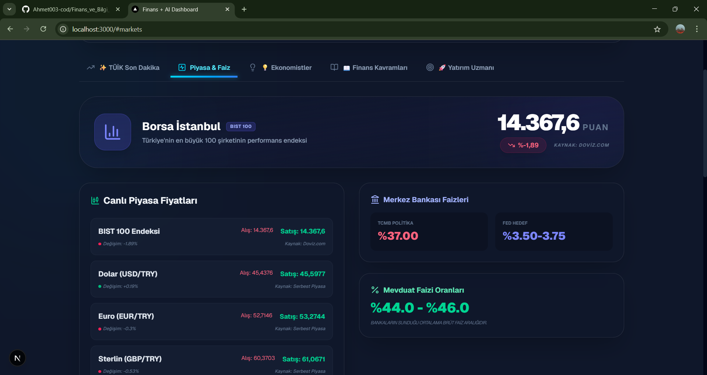
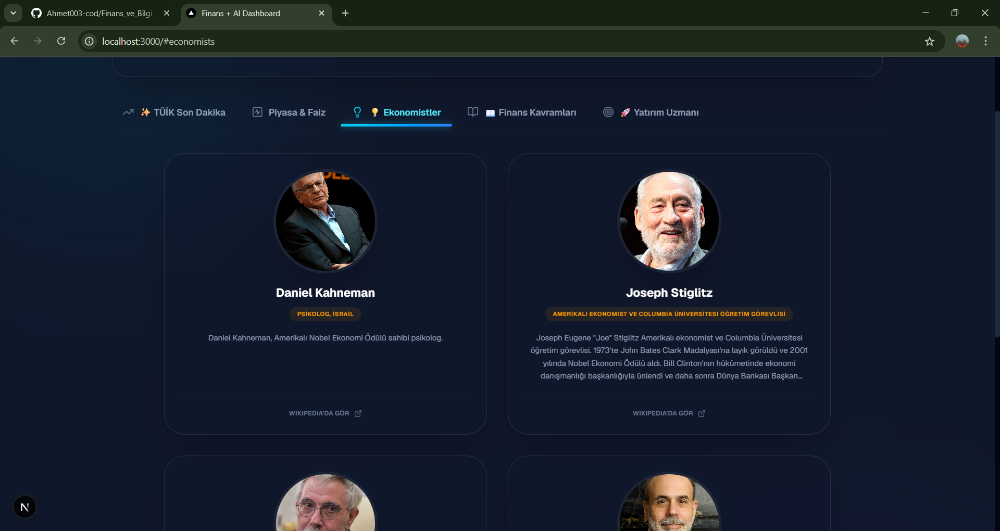
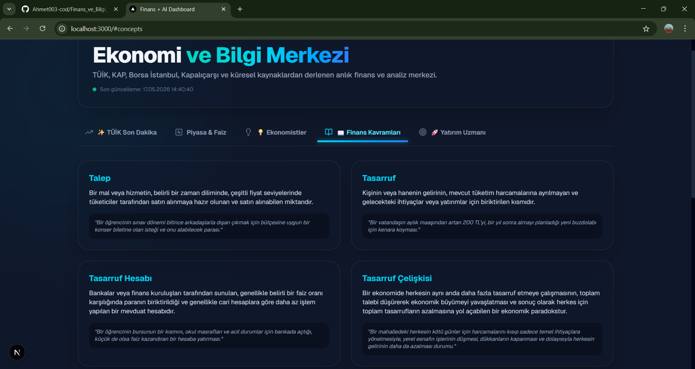
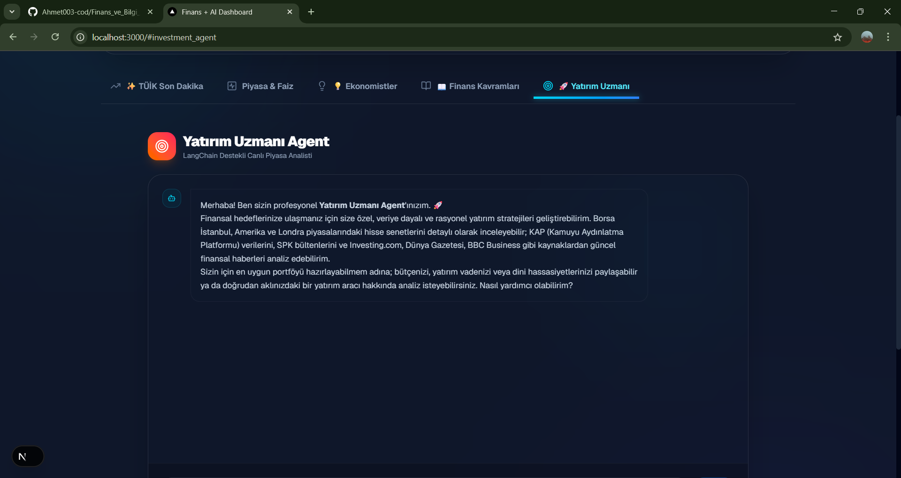

# 🚀 Finans ve Ekonomi Bilgi Merkezi & Yapay Zeka Yatırım Uzmanı


Bu proje; Borsa İstanbul, Kapalıçarşı, TÜİK, KAP (Kamuyu Aydınlatma Platformu), SPK ve küresel piyasalardan anlık veriler çekerek kullanıcıya sunan, aynı zamanda bünyesinde son derece gelişmiş bir **Yapay Zeka Yatırım Uzmanı (Agent)** barındıran tam teşekküllü bir finans platformudur. Hem finansal okuryazarlığı interaktif şekilde artırmayı hem de kullanıcılara anlık piyasa verilerine dayalı kişiselleştirilmiş yatırım stratejileri sunmayı hedefler.

---

## 1. Proje Hakkında (Vizyon ve Amacımız)
Modern piyasalarda doğru ve şeffaf veriye ulaşmak, ulaşılan bu karmaşık finansal veriyi analiz etmek sıradan yatırımcılar için oldukça zordur. Bu proje, karmaşık finansal verileri (enflasyon oranları, merkez bankası faizleri, bilanço rasyoları ve anlık hisse fiyatları) herkesin anlayabileceği şık ve kullanıcı dostu bir arayüzle sunmak amacıyla geliştirilmiştir. 

Proje, sadece statik bir veri ekranı olmaktan öte, kullanıcının bütçesine, yatırım vadesine ve özellikle **dini hassasiyetlerine (faizli/faizsiz ürün tercihine)** göre otonom analiz yapabilen yapay zeka (LangChain + Gemini) destekli bir altyapıya sahiptir. Böylece sıradan bir kullanıcı bile saniyeler içinde binlerce sayfalık KAP raporunu ve küresel piyasa haberlerini okumuş bir uzmandan tavsiye alabilir.

---

## 2. Temel Özellikler ve Modüller (Arayüz Sıralamasına Göre)

Platform, kullanıcı deneyimini maksimize etmek için 5 ana modülden (sekmeden) oluşmaktadır:

1.  **📊 TÜİK Son Dakika:** 
    <br><br>
    *   TÜFE ve Yİ-ÜFE oranlarının aylık ve yıllık bazda anlık olarak çekildiği ana ekrandır.
    *   **Eğitici Pankartlar:** Sadece sayısal veri sunmaz; enflasyonun (ÜFE ve TÜFE) artması veya azalması durumunda günlük hayatta (market fiyatları, üretim maliyetleri vb.) nelerin değişeceğini basit örneklerle anlatır.
2.  **📈 Piyasa & Faiz (Canlı Veriler):** 
    <br><br>
    *   **BIST 100:** Borsa İstanbul'un anlık puan durumu ve günlük yüzde değişimini gösteren özel bir bilgi kartı.
    *   **Kurlar ve Emtia:** Kapalıçarşı canlı Altın, Dolar, Euro fiyatları.
    *   **Faiz Oranları:** TCMB (Türkiye Cumhuriyet Merkez Bankası) politika faizi, ABD Merkez Bankası (FED) hedef faiz aralığı ve Türkiye'deki bankaların sunduğu ortalama mevduat faiz oranları. Ayrıca bu faizlerin ve kurların artıp azalmasının ne anlama geldiğini açıklayan bilgi blokları içerir.
3.  **💡 Ekonomistler:** 
    <br><br>
    *   Tarihe damga vurmuş ünlü ve tarihi ekonomistlerin (Adam Smith, John Maynard Keynes, Karl Marx vb.) biyografilerinin, teorilerinin ve Wikipedia bağlantılarının yer aldığı eğitici ansiklopedi bölümü.
4.  **📖 Finans Kavramları ve Ekonomi Asistanı:** 
    <br><br>
    *   Sık kullanılan ekonomi terminolojisini (Enflasyon, Devalüasyon, Stagflasyon vb.) basitleştiren bir sözlük.
    *   Aynı zamanda bu ekranda temel finansal sorularınızı yanıtlamak için eğitilmiş, Gemini altyapısıyla çalışan hızlı bir chat bot asistanı bulunur.
5.  **🚀 Yatırım Uzmanı Agent'ı (Otonom AI):** 
    <br><br>
    *   Projenin kalbi olan bu bölüm; anlık piyasa verilerini araştırıp analiz eden, canlı haberleri okuyan ve kişiye özel portföy oluşturan otonom ajandır. (Detayları 4. Bölümde açıklanmıştır).

---

## 3. Kullanılan Veri Kaynakları ve Teknolojiler

Proje, veriyi manuel olarak saklamaz; gücünü gerçek zamanlı çoklu veri kaynaklarından ve modern web teknolojilerinden alır.

### 🌐 Veri Kaynakları
*   **KAP & SPK:** Şirketlerin KAP (Kamuyu Aydınlatma Platformu) resmi bilanço verileri, finansal rasyoları (F/K, PD/DD), yayınladıkları son resmi duyurular ve SPK bültenleri ajanın doğrudan erişebildiği kaynaklardır.
*   **TÜİK:** Resmi tüketici ve üretici fiyat endeksi (enflasyon) istatistikleri ve aylık haber bültenleri.
*   **Küresel & Yerel Piyasalar:** Borsa İstanbul (BİST 100), ABD piyasaları (S&P 500, NASDAQ vb.) ve Londra hisse senedi piyasaları (LSE), Kapalıçarşı canlı Altın/Gümüş ve döviz kurları.
*   **Haber Kaynakları:** Investing.com (TR), Dünya Gazetesi ve BBC Business platformları üzerinden otonom anlık piyasa haberleri ve hisse duygu (sentiment) analizi.

### 💻 Teknoloji Yığını (Tech Stack)
*   **Frontend (İstemci):** Next.js 14 (App Router), React, TailwindCSS, Framer Motion (Mikro-animasyonlar), Lucide Icons.
*   **Backend (API Sunucusu):** Next.js API Routes (Node.js) üzerinden TypeScript tabanlı sunucu taraflı işlemler.
*   **Yapay Zeka (Agentic AI):** Python, LangChain, Google Generative AI (Gemini 2.5 Flash).
*   **Web Scraping & Veri İşleme:** JavaScript tarafında Puppeteer ve Cheerio; Python tarafında ise BeautifulSoup (bs4), Requests ve YFinance.

---

## 4. Yatırım Uzmanı Agent'ı (Gelişmiş AI Entegrasyonu)

`yatırım_uzmanı_agentı` klasöründe yer alan yapay zeka mimarisi, standart bir "soru-cevap" modelinin çok ötesindedir. **ReAct (Reasoning and Acting)** mantığıyla çalışır; yani kendisine verilen görevi parçalara böler, düşünür ve gerekli araçları (tools) kullanarak harekete geçer.

*   **Otonom Karar Verme (25+ Tools):** Ajanın Python tarafında tanımlanmış 25'ten fazla özel aracı vardır. Örneğin bir kullanıcı "THYAO hissesi alınır mı?" diye sorduğunda; ajan önce `get_bist_stock_price` ile güncel hisse fiyatını çeker, ardından `get_kap_full_analysis` ile KAP'tan resmi bilançosunu inceler, son olarak `analyze_all_news_sources` ile Investing/Dünya/BBC'den şirketle ilgili haberleri okur ve tüm bu devasa veriyi sentezleyerek rasyonel bir rapor sunar.
*   **Dini Hassasiyet ve Profilleme Modülü:** Ajan, görüşmeye başlarken kullanıcıya "Yatırımda dini hassasiyetiniz veya faizsiz ürün tercihiniz var mı?" sorusunu sorar. Kullanıcı "Evet" yanıtı verirse; sistem anında yön değiştirir, faizli mevduat veya tahvil gibi araçları sistemden tamamen bloke eder. Kullanıcıya Altın, Gümüş, Sukuk (Kira Sertifikası), Döviz ve Katılım Fonları üzerinden detaylı, helal (faizsiz) portföy senaryoları üretir.
*   **Küresel Vizyon:** Ajan bir BIST hissesini analiz ederken, gerekli gördüğünde Amerika veya Londra piyasalarındaki global rakiplerinin verilerini de eşzamanlı olarak çekip karşılaştırmalı küresel bir analiz tablosu oluşturabilir.

---

## 5. Kurulum ve Çalıştırma Talimatları (Zorunlu Gemini API Kullanımı)

Bu projeyi yerel ortamınızda (lokalde) çalıştırmak için aşağıdaki adımları sırasıyla izlemelisiniz.

> **⚠️ ÇOK ÖNEMLİ (GEMINI API ZORUNLULUĞU):** Bu projedeki hem Ekonomi Asistanı botu hem de gelişmiş Yatırım Uzmanı Agent'ı doğrudan Google Gemini altyapısını kullanmaktadır. Projenin düzgün çalışabilmesi için geçerli bir **Google Gemini API Key**'e sahip olmanız ve bunu projeye tanıtmanız ZORUNLUDUR.

### Ön Koşullar
*   Node.js (v18 veya üzeri)
*   Python (3.10 veya üzeri) ve `pip` paket yöneticisi.

### Adım 1: Projeyi Klonlayın ve Node.js Bağımlılıklarını Yükleyin
```bash
git clone https://github.com/kullaniciadi/finans-sitesi.git
cd finans-sitesi/finans-sitesi-app
npm install
```

### Adım 2: Python (Yapay Zeka) Bağımlılıklarını Kurun
Yatırım Uzmanı Ajanının çalışabilmesi için gerekli Python kütüphanelerini yükleyin:
```bash
cd yatırım_uzmanı_agentı
pip install -r requirements.txt
cd ..
```
*(Not: Sisteminizde `python` yerine `python3` veya `pip3` kullanmanız gerekebilir.)*

### Adım 3: Çevresel Değişkenleri (.env) Ayarlayın
Proje ana dizininde (`finans-sitesi-app` klasörü içinde) bir `.env` dosyası oluşturun ve içerisine Google AI Studio üzerinden aldığınız API anahtarını ekleyin:
```env
GOOGLE_API_KEY=sizin_gemini_api_anahtariniz_buraya_gelecek
```
*(Bu anahtar olmadan projenin yapay zeka modülleri çalışmayacaktır!)*

### Adım 4: Projeyi Başlatın
Tüm kurulumları tamamladıktan sonra Next.js geliştirme sunucusunu başlatın:
```bash
npm run dev
```
Uygulama **`http://localhost:3000`** adresinde çalışmaya başlayacaktır.

*Arka plandaki çalışma mantığı:* Next.js uygulaması üzerindeki arayüzden gönderilen sorular, Next.js API Routes (Backend) üzerinden yakalanır ve Node.js'in `child_process.spawn` yeteneği kullanılarak arka plandaki Python (LangChain) betiklerine iletilir. AI'ın oluşturduğu otonom sonuçlar tekrar frontend'e aktarılarak kullanıcıya sunulur.

---

*Bu proje; finansal verilere tamamen şeffaf, demokratik bir erişim sağlamak ve modern yapay zeka (AI) teknolojilerinin karmaşık finansal dünyada kişisel yatırım stratejilerine nasıl devrim niteliğinde yön verebileceğini göstermek amacıyla geliştirilmiştir.*
